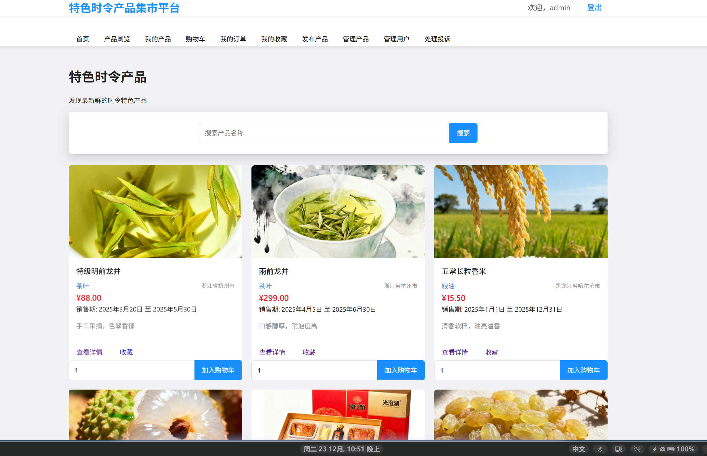
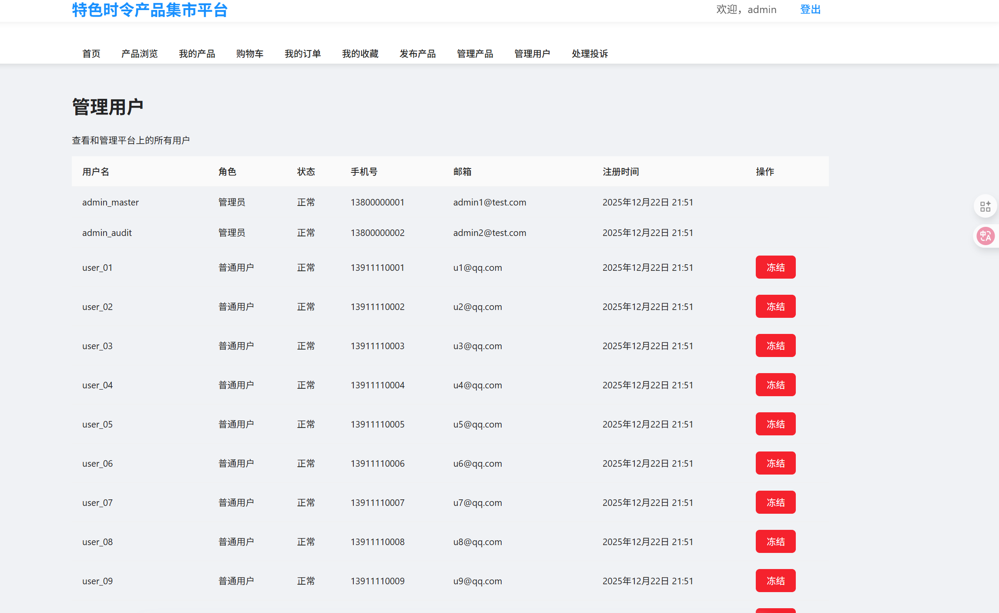
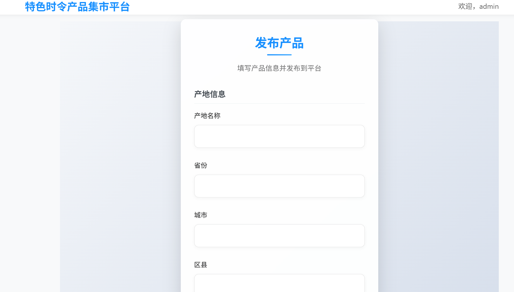
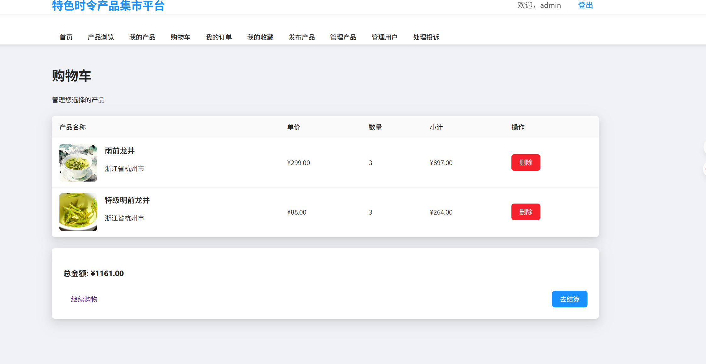

# 特色时令产品集市平台 HarvestBazaar

For this "特色时令产品集市平台" (Specialty Seasonal Products Market Platform), I recommend the English name:

**HarvestBazaar**

### Reasoning:
- **Harvest**: Directly conveys the seasonal nature of products and the concept of fresh, timely produce
- **Bazaar**: Evokes a vibrant,特色 marketplace atmosphere that's more distinctive than generic terms like "market" or "shop"
- **Memorable**: Short, easy to pronounce, and has good domain name potential
- **Brandable**: Sounds warm, inviting, and aligns with the platform's focus on specialty seasonal goods

### 名称由来：
- **Harvest**（收获）：直接传达了产品的时令特性和新鲜、及时的农产品概念
- **Bazaar**（集市）：唤起充满活力的特色市场氛围，比"market"或"shop"等通用术语更具特色
- **易记性**：简短、易发音，具有良好的域名潜力
- **品牌友好**：听起来温暖、诱人，符合平台专注于特色时令商品的定位


HarvestBazaar在描述性、易记性和品牌友好性之间取得了最佳平衡。

## 项目概述
特色时令产品集市平台是一个集产品展示、销售、管理于一体的电子商务平台，专注于推广和销售各类时令特色产品。平台支持用户注册、产品管理、订单处理、收藏、购物车和投诉处理等功能。

## 功能特性

### 用户管理

- **用户注册**：支持管理员和普通用户注册，系统自动记录注册时间和IP地址
- **用户登录**：安全的身份验证系统，支持冻结用户登录拦截和错误提示
- **用户登出**：安全退出系统，清除会话信息和认证状态
- **角色管理**：基于角色的访问控制（管理员 vs 普通用户），不同角色拥有不同权限
- **账户状态**：支持账户冻结/解冻功能，冻结后用户无法登录并显示拦截提示
- **权限控制**：精细化的权限管理，确保用户只能执行授权操作
- **个人信息**：用户可以查看和管理自己的个人信息

### 产品管理

- **产品发布**：卖家可以发布新产品信息，包括名称、价格、描述、产地、分类、销售周期、图片等
- **产品编辑**：支持修改已发布产品的所有信息，保持数据的最新性
- **产品下架/上架**：可以灵活切换产品销售状态，控制产品的可见性和可购买性
- **产品删除**：用户可以删除自己发布的产品，管理员可以删除所有产品
- **产品浏览**：用户可以浏览所有上架产品，支持分页展示和列表排序
- **产品搜索**：支持按产品名称搜索产品，快速定位所需商品
- **分类筛选**：支持按产品类别（茶叶、粮油、水果、水产、干果、其他）筛选，提供直观的分类树
- **类别点击筛选**：点击产品卡片中的类别名称，自动筛选该类别下的所有产品
- **标签管理**：产品可以添加标签便于分类和推荐，提高产品曝光率
- **产品详情**：展示产品的详细信息，包括价格、描述、产地、销量、库存等
- **产地管理**：产品关联具体产地信息（省、市、区），支持按产地筛选
- **销售周期**：产品可以设置销售开始和结束时间，自动控制销售时间范围

### 订单处理

- **添加购物车**：用户可以将产品加入购物车，支持指定购买数量
- **购物车管理**：支持查看购物车产品、修改产品数量、删除购物车商品
- **购物车清空**：可以批量删除购物车中的所有商品
- **订单创建**：可以从购物车创建订单购买产品，支持多商品合并订单
- **订单确认**：创建订单时确认购买信息、收货地址等
- **订单支付**：支持在线支付功能，支付后自动更新订单状态
- **订单状态**：多状态跟踪（待支付、已支付、已完成、已取消），支持状态流转
- **订单详情**：查看订单的详细信息，包括购买的产品、数量、单价、总价、运费等
- **订单列表**：用户可以查看自己的所有订单记录，支持按状态筛选
- **订单历史**：保留完整的订单交易历史，便于用户查询

### 购物车功能
- **购物车商品展示**：清晰展示购物车中的所有商品，包括图片、名称、价格、数量等
- **数量调整**：支持增加或减少商品数量，自动更新小计和总计
- **商品删除**：可以单个删除购物车中的商品
- **批量操作**：支持批量选择和删除商品
- **订单创建**：一键从购物车创建订单，简化购买流程
- **购物车清空**：可以清空购物车中的所有商品

### 收藏功能
- **收藏产品**：用户可以收藏感兴趣的产品，方便后续查看
- **取消收藏**：可以随时取消收藏的产品，灵活管理收藏列表
- **收藏列表**：用户可以查看自己收藏的所有产品，支持分页和搜索
- **收藏状态**：产品卡片上显示收藏状态，支持快速切换

### 投诉处理
- **提交投诉**：用户可以对已支付或已完成的订单提交投诉，说明投诉原因和诉求
- **投诉管理**：管理员可以查看所有待处理的投诉，按状态筛选
- **投诉处理**：管理员可以处理投诉并提供处理意见和结果
- **处理记录**：系统自动记录投诉处理过程和结果
- **违规记录**：系统自动记录投诉处理和用户违规情况，支持追溯

### 管理员功能
- **用户管理**：查看和管理所有用户，包括冻结/解冻用户、查看用户信息、修改用户权限
- **产品管理**：查看和管理所有产品，包括发布、编辑、下架/上架、删除产品
- **订单管理**：查看和管理所有订单，跟踪订单状态，处理订单问题
- **投诉处理**：查看和处理用户提交的投诉，生成违规记录
- **违规管理**：查看系统记录的所有违规操作和处理结果
- **数据统计**：提供产品销售数据统计和分析功能
- **批量操作**：支持对用户和产品进行批量操作，提高管理效率

### API接口
- **RESTful API**：提供完整的API接口，支持前后端分离开发
- **多路径兼容**：支持多种API路径格式（如/api/classifications/和/myapp/index/classification/list/），确保前端兼容性
- **数据格式统一**：返回统一的JSON格式数据，便于前端处理和解析
- **参数支持**：支持多种查询参数（如排序、筛选、分页等），满足不同查询需求
- **响应格式**：统一的响应格式，包含状态码、数据和消息，便于错误处理

### 数据安全与验证
- **表单验证**：所有用户输入都经过严格的表单验证，防止无效数据
- **权限验证**：确保用户只能访问自己有权限的功能，防止越权操作
- **数据约束**：数据库层面设置约束（如非空、唯一、外键等），确保数据完整性
- **事务处理**：关键操作（如订单创建、支付等）使用事务，确保数据一致性
- **输入过滤**：对用户输入进行过滤和转义，防止XSS和SQL注入攻击
- **密码加密**：用户密码采用安全的加密算法存储，保护用户隐私

### 系统管理
- **系统配置**：支持灵活的系统配置，如静态文件路径、数据库连接、邮件设置等
- **日志管理**：系统操作日志记录，便于问题排查和审计
- **错误处理**：完善的错误处理机制，提供友好的错误提示
- **静态文件处理**：统一的静态文件管理，支持前端资源加载
- **媒体文件管理**：产品图片等媒体文件的上传和管理

### 用户体验
- **响应式设计**：支持不同设备和屏幕尺寸的访问，提供良好的移动端体验
- **直观界面**：简洁明了的用户界面，操作流程简单易懂
- **快速搜索**：高效的搜索功能，快速定位所需产品
- **流畅交互**：响应迅速的交互体验，提高用户满意度
- **友好提示**：清晰的操作提示和错误信息，引导用户正确操作

## 技术栈

### 后端
- **框架**：Django 5.2.9
- **数据库**：MySQL
- **ORM**：Django ORM
- **API**：RESTful API
- **认证**：Django Auth

### 前端
- **框架**：Vue.js 2.x
- **UI组件库**：Ant Design Vue
- **HTTP客户端**：Axios
- **构建工具**：Webpack

### 部署
- **服务器**：Django开发服务器（开发环境）
- **静态文件**：Django静态文件处理
- **媒体文件**：Django媒体文件处理

## 系统架构

1. **客户端层**：Vue.js前端应用，提供用户界面
2. **API层**：Django RESTful API，处理前端请求
3. **业务逻辑层**：Django视图函数，实现业务逻辑
4. **数据访问层**：Django ORM，与数据库交互
5. **数据存储层**：MySQL数据库，存储系统数据

## 安装和运行

### 环境要求
- Python 3.10+
- Node.js 14+
- MySQL 8.0+

### 安装步骤

1. **克隆项目**
```bash
git clone <repository-url>
cd DjangoProject
```

2. **创建虚拟环境**
```bash
python -m venv venv
```

3. **激活虚拟环境**
```bash
# Windows
venv\Scripts\activate
# Linux/Mac
source venv/bin/activate
```

4. **安装Python依赖**
```bash
pip install -r requirements.txt
```

5. **配置数据库**
```bash
# 在settings.py中配置数据库连接信息
DATABASES = {
    "default": {
        "ENGINE": "django.db.backends.mysql",
        "NAME": "specialty_market",
        "USER": "root",
        "PASSWORD": "your_password",
        "HOST": "localhost",
        "PORT": "3306",
    }
}
```

6. **创建数据库**
```bash
mysql -u root -p
CREATE DATABASE specialty_market CHARACTER SET utf8mb4 COLLATE utf8mb4_unicode_ci;
```

7. **迁移数据库**
```bash
python manage.py makemigrations
python manage.py migrate
```

8. **创建超级用户**
```bash
python manage.py createsuperuser
```

9. **编译前端代码**
```bash
cd web
npm install
npm run build
cd ..
```

10. **收集静态文件**
```bash
python manage.py collectstatic
```

11. **运行服务器**
```bash
python manage.py runserver
```

12. **访问网站**
打开浏览器访问 http://127.0.0.1:8000/

## 系统功能界面及核心操作说明

### 1. 平台首页（图4-1、图4-5）
- **功能说明**：展示所有上架的时令特产列表，支持分类筛选和产品搜索
- **核心操作**：
  - 浏览所有上架的特产产品
  - 使用分类树（茶叶、粮油、水果、水产、干果、其他）快速筛选产品
  - 点击产品卡片中的类别名称，查看该类别下的所有产品
  - 使用搜索框按产品名称搜索产品
  - 点击产品卡片进入产品详情页
- **技术实现**：基于 Vue.js 实现的响应式界面，通过 API 从 `thing_list` 视图中读取当前上架的特产数据，支持分类筛选和排序功能

### 2. 产品详情页
- **功能说明**：展示产品的详细信息，支持购买和收藏操作
- **核心操作**：
  - 查看产品的名称、价格、描述、产地等详细信息
  - 将产品添加到购物车
  - 收藏感兴趣的产品
  - 查看其他用户对该产品的评论
- **技术实现**：通过 `thing_detail` 或 `thing_detail_query` API 获取产品详情数据，支持图片展示和交互操作

### 3. 购物车与模拟下单（图4-6）
- **功能说明**：管理用户添加的产品，支持创建订单
- **核心操作**：
  - 查看购物车中的所有产品
  - 删除不需要的购物车商品
  - 从购物车创建订单
  - 填写订单信息并提交
- **技术实现**：通过 `add_to_cart`、`shopping_cart`、`delete_cart_item` 和 `create_order` API 实现购物车管理和订单创建功能，验证了 `shopping_carts` 与 `order_items` 表的主外键约束及非空约束的有效性

### 4. 订单管理页（图4-2）
- **功能说明**：管理用户的订单，查看订单详情和状态
- **核心操作**：
  - 查看所有订单记录
  - 跟踪订单处理状态（待支付、已支付、已完成、已取消）
  - 查看订单的详细信息，包括购买的产品、数量、总价等
  - 支付待支付的订单
  - 对已支付或已完成的订单提交投诉
- **技术实现**：通过 `user_orders`、`order_detail` 和 `pay_order` API 实现订单管理功能，调用 `order_detail` 视图展示订单详细清单

### 5. 产品发布与管理
- **功能说明**：用户可以发布、编辑和管理自己的产品
- **核心操作**：
  - 发布新产品，填写产品的详细信息
  - 编辑已发布产品的信息
  - 切换产品的上架/下架状态
  - 删除不再销售的产品
- **技术实现**：通过 `publish_specialty`、`edit_specialty`、`toggle_specialty_status` 和 `delete_specialty` API 实现产品管理功能

### 6. 收藏管理
- **功能说明**：管理用户收藏的产品
- **核心操作**：
  - 收藏感兴趣的产品
  - 取消收藏的产品
  - 查看所有收藏的产品
- **技术实现**：通过 `collect_specialty`、`cancel_collect` 和 `user_collections` API 实现收藏管理功能

### 7. 投诉处理功能
- **功能说明**：用户提交投诉，管理员处理投诉
- **核心操作**：
  - 用户对已支付或已完成的订单提交投诉
  - 管理员查看所有待处理的投诉
  - 管理员处理投诉并提供处理意见
- **技术实现**：通过 `submit_complaint`、`admin_complaints` 和 `handle_complaint` API 实现投诉处理功能，前端提交投诉后，数据库自动生成对应的投诉记录

### 8. 管理员后台管理
- **功能说明**：管理员管理平台的用户、产品和投诉
- **核心操作**：
  - 查看和管理所有用户，包括冻结/解冻操作
  - 查看和管理所有产品，包括下架/上架操作
  - 查看和处理用户提交的投诉
  - 查看系统记录的违规操作和处理结果
- **技术实现**：通过 `admin_users`、`admin_toggle_user_status`、`admin_specialties`、`admin_toggle_specialty`、`admin_complaints` 和 `handle_complaint` API 实现管理员管理功能

### 9. 用户认证与账户管理
- **功能说明**：用户注册、登录和账户状态管理
- **核心操作**：
  - 用户注册新账号
  - 用户登录系统
  - 用户安全退出系统
  - 管理员冻结/解冻用户账号
  - 冻结用户登录时触发拦截提示
- **技术实现**：通过 `register`、`user_login` 和 `user_logout` API 实现用户认证功能，管理员可以通过 `admin_toggle_user_status` API 冻结/解冻用户账号，冻结后用户登录时会触发拦截提示

### 10. 违规处理与记录（图4-4、图4-8）
- **功能说明**：记录和处理用户违规行为
- **核心操作**：
  - 管理员处理用户投诉时自动生成违规记录
  - 管理员对用户产品进行违规处理时生成违规记录
  - 查看系统记录的所有违规操作和处理结果
- **技术实现**：通过 `ViolationRecord` 模型记录违规行为，管理员冻结账号后，用户登录时触发拦截提示展示，通过手动向 `violation_records` 表插入违规数据，模拟管理员冻结多次违规用户的功能

### 11. 数据统计与分析
- **功能说明**：提供产品销售数据统计功能，帮助管理员了解平台运营情况
- **核心操作**：
  - 查看产品销售数据和销售额
  - 分析销售趋势和用户购买行为
  - 统计热门产品和分类，优化产品推荐
- **技术实现**：通过数据库查询和统计功能实现数据统计和分析，使用SQL聚合函数和Django ORM进行数据处理

### 12. 产品编辑与下架
- **功能说明**：产品发布者可以编辑已发布的产品信息或下架产品
- **核心操作**：
  - 点击产品详情页的"编辑"按钮进入编辑页面
  - 修改产品名称、价格、描述、分类等信息
  - 点击"保存"按钮更新产品信息
  - 点击"下架"按钮将产品从销售列表中移除
- **技术实现**：通过 `edit_specialty` 和 `toggle_specialty_status` 视图实现，使用表单验证确保数据有效性

### 13. 支付流程
- **功能说明**：用户可以安全地支付订单，支持多种支付方式
- **核心操作**：
  - 在订单确认页或订单详情页点击"立即支付"按钮
  - 选择支付方式并完成支付操作
  - 支付成功后自动跳转至订单成功页面
- **技术实现**：通过 `pay_order` 视图处理支付逻辑，更新订单状态，确保支付过程的安全性和数据一致性

### 14. 订单成功页
- **功能说明**：订单支付成功后显示的确认页面
- **核心操作**：
  - 显示订单支付成功信息和订单号
  - 提供查看订单详情的链接
  - 提供返回首页的链接
- **技术实现**：通过 `order_success` 视图实现，显示成功信息并提供后续操作入口

### 15. 用户发布产品管理
- **功能说明**：用户可以管理自己发布的所有产品
- **核心操作**：
  - 查看自己发布的所有产品列表
  - 对产品进行编辑、下架、删除操作
  - 按状态筛选产品（上架/下架）
- **技术实现**：通过 `user_specialties` 视图实现，查询当前用户发布的所有产品并支持状态筛选

### 16. 用户订单列表
- **功能说明**：用户可以查看和管理自己的所有订单
- **核心操作**：
  - 查看所有订单记录
  - 按订单状态筛选（待支付、已支付、已完成、已取消）
  - 查看订单详情和支付订单
- **技术实现**：通过 `user_orders` 视图实现，查询当前用户的所有订单并支持状态筛选

## API接口

### 分类API
- `GET /api/classifications/`：获取分类列表
- `GET /myapp/index/classification/list/`：获取分类列表（兼容前端路径）

### 产品API
- `GET /api/things/`：获取产品列表（支持分类筛选和排序）
- `GET /myapp/index/thing/list/`：获取产品列表（兼容前端路径）
- `GET /api/thing/<int:thing_id>/`：通过ID获取产品详情
- `GET /api/thing/detail/?id=xxx`：通过查询参数获取产品详情
- `GET /myapp/index/thing/detail/`：通过查询参数获取产品详情（兼容前端路径）
- `GET /products/`：产品列表页面
- `GET /product/detail/`：产品详情页面

### 标签API
- `GET /api/tags/`：获取标签列表

### 公告API
- `GET /api/notices/`：获取公告列表

### 评论API
- `GET /api/comments/?thingId=xxx&order=xxx`：获取产品评论列表（支持排序）
- `POST /api/comment/create/`：创建新评论
- `POST /api/comment/like/`：点赞评论
- `GET /api/comments/my/`：获取当前用户的评论列表

### 用户认证API
- `POST /register/`：用户注册
- `POST /login/`：用户登录
- `GET /logout/`：用户登出

### 产品管理API
- `GET /specialty/<int:specialty_id>/`：获取产品详情页面
- `POST /publish/`：发布新产品
- `GET /user/specialties/`：获取当前用户发布的产品列表
- `POST /specialty/<int:specialty_id>/edit/`：编辑产品信息
- `POST /specialty/<int:specialty_id>/toggle/`：切换产品上架/下架状态
- `POST /specialty/<int:specialty_id>/delete/`：删除产品

### 购物车与订单API
- `POST /cart/add/<int:specialty_id>/`：将产品添加到购物车
- `GET /cart/`：查看购物车
- `POST /cart/delete/<int:cart_id>/`：删除购物车中的产品
- `POST /order/create/`：创建订单
- `GET /order/<int:order_id>/`：查看订单详情
- `GET /user/orders/`：获取当前用户的订单列表
- `POST /order/<int:order_id>/pay/`：支付订单

### 收藏API
- `POST /collect/add/<int:specialty_id>/`：收藏产品
- `POST /collect/<int:collect_id>/cancel/`：取消收藏
- `GET /user/collections/`：获取收藏列表

### 投诉API
- `POST /order/<int:order_id>/complaint/`：提交投诉

### 管理员API
- `GET /admin-complaints/`：查看待处理投诉（管理员）
- `POST /admin-complaint/<int:complaint_id>/handle/`：处理投诉（管理员）
- `GET /admin-specialties/`：查看所有产品（管理员）
- `POST /admin-specialty/<int:specialty_id>/toggle/`：切换产品状态（管理员）
- `GET /admin-users/`：查看所有用户（管理员）
- `POST /admin-user/<int:user_id>/toggle/`：切换用户状态（管理员）
- `GET /admin-users/`：查看所有用户（管理员）
- `POST /admin-user/<int:user_id>/toggle/`：冻结/解冻用户账号（管理员）
- `GET /admin-specialties/`：查看所有产品（管理员）
- `POST /admin-specialty/<int:specialty_id>/toggle/`：下架/上架产品（管理员）

### 其他API
- `GET /`：平台首页，展示所有上架产品
- `GET /index/`：平台首页（兼容路径）
- `GET /submit-complaint/<int:order_id>/`：提交投诉页面
- `GET /order-success/`：订单支付成功页面
- `GET /create-order/`：创建订单页面

## API接口详细说明

### 请求方法
- `GET`：用于获取资源
- `POST`：用于创建或更新资源
- `PUT`：用于更新资源
- `DELETE`：用于删除资源

### 响应格式
所有API接口返回统一的JSON格式：
```json
{
  "code": 200,  // 状态码，200表示成功，其他表示错误
  "data": {...},  // 响应数据
  "message": "成功"  // 响应消息
}
```

### 常见错误码
- `400`：请求参数错误
- `401`：未登录或登录已过期
- `403`：权限不足
- `404`：资源不存在
- `500`：服务器内部错误

### 分页参数
- `page`：页码，默认1
- `page_size`：每页数量，默认10

### 排序参数
- `sort`：排序字段，如"price"、"sales"
- `order`：排序方式，"asc"表示升序，"desc"表示降序

### 筛选参数
- `category_id`：分类ID
- `search`：搜索关键词
- `status`：状态筛选

## 项目结构

```
DjangoProject/
├── DjangoProject/              # 项目配置目录
│   ├── settings.py            # 项目设置（静态文件、数据库、认证等）
│   ├── urls.py                # 主URL配置
│   ├── wsgi.py                # WSGI配置
│   └── asgi.py                # ASGI配置
├── market/                    # 应用目录
│   ├── management/            # 自定义管理命令
│   ├── migrations/            # 数据库迁移文件
│   ├── templates/             # 模板文件
│   │   └── market/            # 应用模板目录
│   │       ├── base.html      # 基础模板（页面结构）
│   │       ├── navigation.html # 导航栏模板
│   │       ├── index.html     # 首页模板
│   │       └── ...            # 其他功能模板
│   ├── templatetags/          # 自定义模板标签
│   │   └── market_filters.py  # 产品图片等自定义过滤器
│   ├── __init__.py
│   ├── admin.py               # 后台管理配置
│   ├── apps.py                # 应用配置
│   ├── forms.py               # 表单定义
│   ├── models.py              # 数据模型
│   ├── tests.py               # 测试文件
│   ├── urls.py                # 应用URL配置
│   ├── utils.py               # 工具函数
│   └── views.py               # 视图函数
├── static/                    # 全局静态文件
├── media/                     # 媒体文件（产品图片等）
│   └── product_images/        # 产品图片存储目录
├── web/                       # Vue.js前端代码
│   ├── build/                 # 构建配置
│   ├── config/                # 项目配置
│   ├── src/                   # 源代码
│   │   ├── components/        # Vue组件
│   │   ├── views/             # Vue视图
│   │   ├── router/            # Vue路由
│   │   └── main.js            # Vue入口文件
│   ├── static/                # 静态资源
│   ├── .babelrc
│   ├── index.html
│   ├── package.json
│   └── vue.config.js          # Vue配置文件（publicPath等）
├── .gitignore
├── manage.py                  # Django管理脚本
├── requirements.txt           # Python依赖列表
└── README.md                  # 项目说明文档
```

## 模板结构与自定义功能

### 模板继承
- 使用Django的模板继承机制，以`base.html`为基础模板，其他页面模板继承自该模板
- `navigation.html`提供统一的导航栏，包含登录/注册、产品分类、购物车等链接
- 模板继承结构确保页面风格统一，便于维护

### 自定义模板标签与过滤器
- `market_filters.py`中定义了`product_image`过滤器，用于处理产品图片的显示
- 支持产品图片的默认图显示和错误处理，提高用户体验

### 响应式设计
- 使用Bootstrap框架实现响应式布局，支持不同设备和屏幕尺寸
- 产品网格在移动端自动调整为单列显示，确保良好的移动端体验
- 导航栏在移动端自动折叠为汉堡菜单，节省屏幕空间

### 静态文件处理
- 配置了`STATICFILES_DIRS`包含Vue的`dist`目录，确保Django能正确加载Vue构建的静态资源
- 产品图片等媒体文件存储在`media`目录，通过`MEDIA_URL`和`MEDIA_ROOT`配置访问路径
- 执行`python manage.py collectstatic`命令收集所有静态资源到`STATIC_ROOT`目录

## 开发说明

### 前端开发
```bash
cd web
npm run serve  # 启动前端开发服务器
```

### 后端开发
```bash
python manage.py runserver  # 启动后端开发服务器
```

### 数据库管理
```bash
python manage.py makemigrations  # 生成数据库迁移文件
python manage.py migrate  # 应用数据库迁移
```

### 静态文件管理
```bash
python manage.py collectstatic  # 收集静态文件
```

## 许可证

MIT License

## 联系方式

如有问题或建议，请联系项目维护人员。
